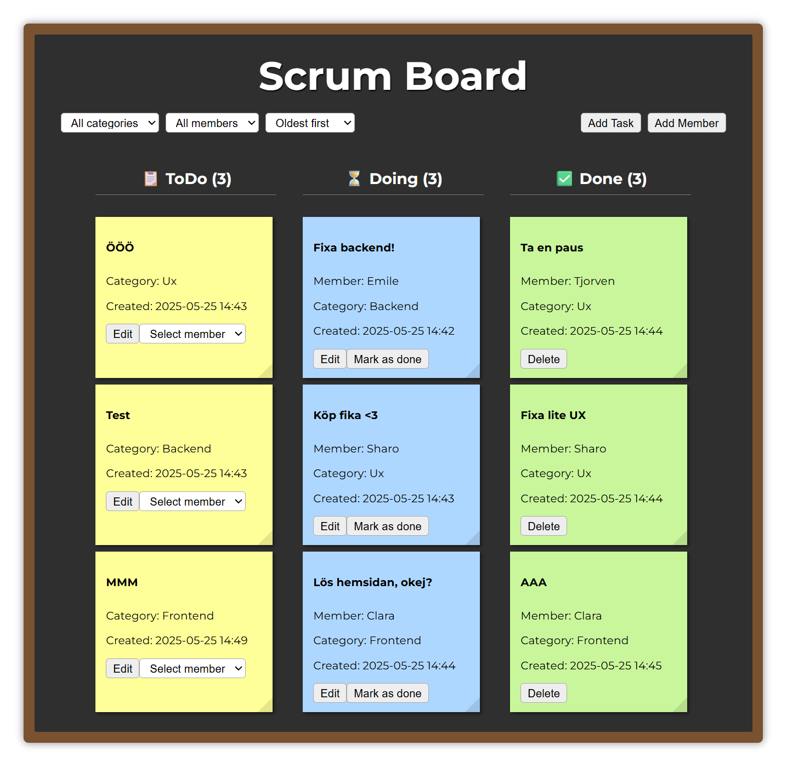

# 🧩 Scrum Board

En enkel scrum board-app byggd med React, Firebase Realtime Database och Parcel. Projektet låter användare skapa teammedlemmar med roller, lägga till och hantera uppgifter i ett klassiskt flöde: ToDo → Doing → Done.

## 🔍 Förhandsvisning

📸 Exempel på boardens UI:


## 🚀 Demo

[](https://olikal.github.io/JAVA24-AJS-slutprojekt-oliver-kalthoff/)

## 🛠 Funktioner

- Skapa uppgifter med titel, kategori och datum
- Tilldela medlem till uppgift (baserat på roll)
- Visuell statusflytt: ToDo, Doing, Done
- Sortering och filtrering (kategori, medlem, titel, datum)
- Modal-formulär för att skapa/redigera uppgifter och medlemmar
- Färdigmarkerade uppgifter går att ta bort
- Felhantering med ErrorBanner
- Griffeltavle-liknande UI med post-it-design

## 🧑‍💻 Tekniker

Frontend:

- React + useState, useEffect
- Parcel bundler
- Komponentbaserad arkitektur
- CSS för layout och post-it-tema

Backend:

- Firebase Realtime Database
- CRUD-operationer med ref, push, set, update, remove
- Automatisk ID-hantering

Övrigt:

- Filter- och sorteringslogik i utils
- Felhantering och återställning av state
- Funktionell kodstruktur och filsystem

## 📁 Projektstruktur

```bash
📁 JAVA24-AJS-slutprojekt-oliver-kalthoff/
├── main.jsx
├── App.jsx
├── index.jsx
├── firebase/
│ ├── config.js
│ ├── tasks.js
│ └── members.js
├── components/
│ ├── Board.jsx
│ ├── TaskCard.jsx
│ ├── TaskColumn.jsx
│ ├── TaskForm.jsx
│ ├── MemberForm.jsx
│ ├── Modal.jsx
│ └── ErrorBanner.jsx
├── utils/
│ ├── filter.js
│ └── formatDate.js
├── css/
│ └── style.css
```

## 🔧 Installation & krav

För att köra projektet lokalt behöver du ha följande installerat:

- [Node.js](https://nodejs.org/) (LTS version)
- npm (medföljer Node.js)

## 📌 Kör projektet lokalt

```bash
git clone https://github.com/olikal/JAVA24-AJS-slutprojekt-oliver-kalthoff.git
cd JAVA24-AJS-slutprojekt-oliver-kalthoff
npm install
npm start
```

🔑 Projektet använder en öppen Firebase Realtime Database – ingen egen konfiguration krävs för att testa appen.

## 🏁 Mål & Bakgrund

📚 _Det här projektet utvecklades som en del av slutprojektet i Avancerad JavaScript på Grit Academymed syfte att visa:_

- _Förståelse för komponentbaserad utveckling i React_
- _Interaktion med extern backend (Firebase)_
- _State management och dynamisk rendering_
- _Användarvänlig design och funktionell UX_
